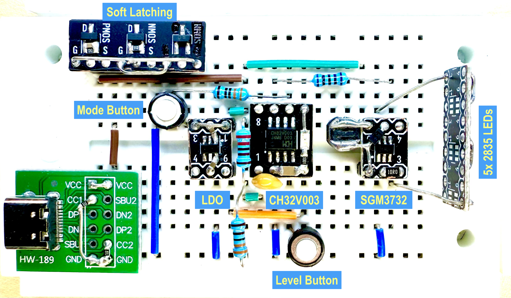

# Portable LED Light with CH32V003 & SGM3732

This project demonstrates a low-cost, USB-powered portable LED light using the CH32V003 RISC-V microcontroller and the SGM3732 high-efficiency LED driver. It features PWM-controlled brightness, support for up to 10 LEDs in series, and a soft latching power circuit for zero standby current. The design is optimized for compactness and energy efficiency, making it ideal for portable lighting applications.

- [Portable LED Light with CH32V003 \& SGM3732](#portable-led-light-with-ch32v003--sgm3732)
  - [Circuit on Breadboard](#circuit-on-breadboard)
  - [Schematic](#schematic)
  - [Features](#features)
  - [Components](#components)
    - [MCU - CH32V003](#mcu---ch32v003)
    - [LED Driver - SGM3732](#led-driver---sgm3732)
    - [Soft Latching Power Circuit](#soft-latching-power-circuit)
    - [LDO - ME6211](#ldo---me6211)
  - [Minimized ch32fun Library](#minimized-ch32fun-library)
  - [References](#references)

## Circuit on Breadboard



## Schematic


## Features

- Low cost
- PWM-controlled brightness
- Up to 10 LEDs in series
- 2.7V to 5.5V power, suitable for lithium batteries
- Soft latching power circuit – ideal for battery-powered applications, as it draws no current once powered off

## Components

### MCU - CH32V003

The CH32V003 is a low-cost, high-performance 32-bit RISC-V microcontroller from WCH. It features a compact design, low power consumption, and a rich set of peripherals, making it ideal for embedded applications and cost-sensitive projects. The CH32V003 supports various interfaces such as UART, SPI, I2C, and PWM, and is well-suited for controlling LED drivers and other hardware components.

With a 750kHz clock (1/32 of the internal high-speed clock), it only draws 1.08 to 1.12mA, which is less than the current consumed by the power LED.

- [CH32V003 Datasheet](./Documents/CH32V003%20Datasheet%20-%20V1.7.PDF)
- [CH32V003 Reference Manual](./Documents/CH32V003%20Reference%20Manual%20-%20V1.7.PDF)

### LED Driver - SGM3732

The [SGM3732](https://www.sg-micro.com/product/SGM3732) is a high-efficiency constant current LED driver with a 1.1MHz PWM boost converter, optimized for compact designs using small components. It can drive up to 10 LEDs in series (up to 38V output) or deliver up to 260mA with 3 LEDs per string, while maintaining high conversion efficiency. LED current is programmable via a digital PWM dimming interface (2kHz–60kHz). The device features very low shutdown current and includes protections such as over-voltage, cycle-by-cycle input current limit, and thermal shutdown. The SGM3732 is available in a TSOT-23-6 package and operates from -40℃ to +85℃.

- [SGM3732 Datasheet Rev A4](./Documents/SGM3732%20Datasheet%20-%20Rev%20A4.pdf)
- [SGM3732 Datasheet Rev A3](./Documents/SGM3732%20Datasheet%20-%20Rev%20A3.pdf) – The older version includes circuit design and component selection guidance.

### Soft Latching Power Circuit

Refer to the [CH32V003 Soft Latching Power Circuits](https://github.com/limingjie/CH32V003-Soft-Latching-Power-Circuits) project.

### LDO - ME6211

The CH32V003 operates from 2.7V to 5.5V, but shows noticeable current fluctuations when powered directly from USB. Using an LDO stabilizes the MCU’s power supply and reduces current consumption by a few milliamps.

- [ME6211 Datasheet - V24](./Documents/ME6211%20Datasheet%20-%20V26.pdf)

## Minimized ch32fun Library

- **`ch32fun.mk`** - Some modifications to accommodate library and tool paths.
  - The `LDFLAGS` path change is for locating the `ch32fun/libgcc.a`.

    ```diff
    <     LDFLAGS+=-L$(CH32FUN)/../misc -lgcc
    ---
    >     LDFLAGS+=-L$(CH32FUN) -lgcc
    ```

    - Otherwise, the compiler would use the default libgcc and throw an incompatible linking error:

      ```text
      .../riscv64-unknown-elf/bin/ld:
      .../riscv-gnu-toolchain/main/lib/gcc/riscv64-unknown-elf/15.1.0/libgcc.a(div.o):
      ABI is incompatible with that of the selected emulation:
      target emulation `elf64-littleriscv' does not match `elf32-littleriscv'
      ```

  - The other two changes are for `minichlink`:

    ```diff
    33c33
    < MINICHLINK?=$(CH32FUN)/../minichlink
    ---
    > MINICHLINK?=$(CH32FUN)
    51c51
    <     LDFLAGS+=-L$(CH32FUN)/../misc -lgcc
    ---
    >     LDFLAGS+=-L$(CH32FUN) -lgcc
    350c350
    <     make -C $(MINICHLINK) all
    ---
    >     # make -C $(MINICHLINK) all
    ```

- **`ch32fun.c`** – Changed line 1728 for 1.5MHz HCLK, resulting in lower power consumption (less than 1.5mA).

  ```c
  1720: #elif defined(FUNCONF_USE_HSI) && FUNCONF_USE_HSI
  1721: #if defined(CH32V30x) || defined(CH32V20x) || defined(CH32V10x)
  1722:     EXTEN->EXTEN_CTR |= EXTEN_PLL_HSI_PRE;
  1723: #endif
  1724: #if defined(FUNCONF_USE_PLL) && FUNCONF_USE_PLL
  1725:     RCC->CFGR0 = BASE_CFGR0;
  1726:     RCC->CTLR  = BASE_CTLR | RCC_HSION | RCC_PLLON; // Use HSI, enable PLL.
  1727: #else
  1728:     RCC->CFGR0 = RCC_HPRE_DIV16;                    // HCLK = SYSCLK / 16
  1729:     RCC->CTLR  = BASE_CTLR | RCC_HSION;             // Use HSI only.
  1730: #endif
  ```

## References

- [Andrew Levido: Soft Latching Power Circuits](https://circuitcellar.com/resources/quickbits/soft-latching-power-circuits/)
- [CNLohr: ch32fun](https://github.com/cnlohr/ch32fun)
- [A Guide to Debouncing](https://my.eng.utah.edu/~cs5780/debouncing.pdf)
- [The simplest button debounce solution](https://www.e-tinkers.com/2021/05/the-simplest-button-debounce-solution/)
- [Museum of the Game - Let's design some POKEY replacements](https://forums.arcade-museum.com/threads/lets-design-some-pokey-replacements.515774/post-4623716)
